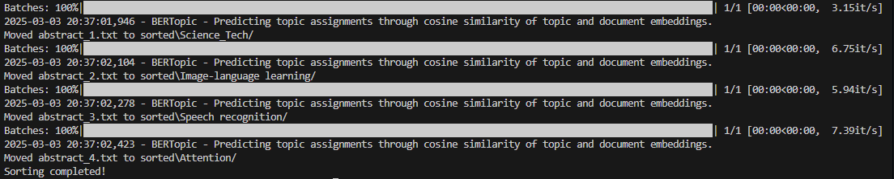

# Research Paper Sorter using BERTopic

This project is a **CLI-based text sorting system** that categorizes research papers based on their abstracts using **BERTopic**. The system automatically detects the topic of an unseen text file, creates a corresponding folder if it doesn't exist, and moves the file into the appropriate category.

## Features
- Uses **BERTopic** for topic modeling
- Automatically creates topic-based folders
- Moves research papers into sorted directories
- Works with `.txt` files in an "unsorted" folder

## Installation

1. **Clone the Repository:**
   ```bash
   git clone <repo-url>
   cd <repo-folder>
   ```

2. **Create a Virtual Environment:**
   ```bash
   conda create -p venv python=3.12
   conda activate ./venv
   ```
   OR using `venv`:
   ```bash
   python -m venv venv
   source venv/bin/activate  # On macOS/Linux
   venv\Scripts\activate     # On Windows
   ```

3. **Install Dependencies:**
   ```bash
   pip install -r requirements.txt
   ```

4. **Download the Pretrained BERTopic Model:**
   Ensure the trained BERTopic model is saved in `my_model_dir`.

## Usage

1. **Prepare Text Files:**
   - Place research paper abstracts as `.txt` files inside the `unsorted` folder.

2. **Run the Script:**
   ```bash
   python sorter.py
   ```

3. **Check the Sorted Folder:**
   - The text files will be moved into topic-based directories inside the `sorted` folder.

## Folder Structure
```
project_root/
│-- unsorted/      # Place input text files here
│-- sorted/        # Output folder with categorized papers
│-- my_model_dir/  # Trained BERTopic model
│-- sorter.py      # Main script
│-- requirements.txt
│-- README.md
```

## Example Output



